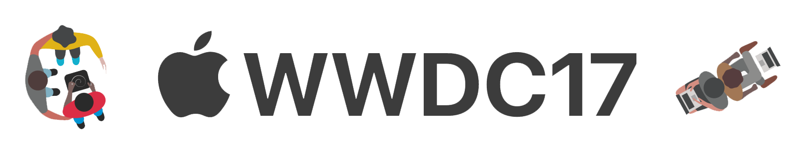

# WWDC 2017 Scholarship Submissions

List of student submissions for the WWDC 2017 scholarship.
To add your own below, just [edit](https://github.com/wwdc/2017/edit/master/README.md) this file and submit a pull request!

<!-- PLEASE READ! -->
<!-- Insert your name below in alphabetical order by first name. -->
<!-- Please only submit the playgrounds that you submitted for WWDC 2017. -->
<!-- Watch out for columns, you must have 6 pipes or else the gh-pages won't like it. -->
<!-- Please choose one of the following values for the status column: Submitted, Rejected or Accepted -->
<!-- Technologies column should contain 2 maximum. -->

| Name | Source |     Video    | Technologies | Status |
|------|--------|--------------|--------------|--------| 
|[Galal Hassan](https://galalhassan.com)| [GitHub](https://github.com/galalmounir/WWDC-2017-Entry)| |more details soon...|Development|
| [Gautham Elango](https://gauthamelango.com/)|[git.gcubed.co](https://git.gcubed.co/wwdc2017/)| |Swift, SpriteKit, UIKit, Machine Learning, Minimax |Submitted |
| [Hengyu](https://twitter.com/hengyuy) | [GitHub](https://github.com/hengyu/Mother)| | |Development |
|[Jai Bhavnani](https://github.com/jbhav24)|Update Soon| | Gesture Recognizer, Core Animation, SpriteKit, UIKit, AVFoundation, Core Graphics, Core Images| Development|
|[Jose Antonio González](https://github.com/josegrobles)|[GitHub](https://github.com/josegrobles/WWDC2017/)||SpriteKit, SceneKit, QuartzCore, PlaygroundBook| Submitted|
| [Kyle Spadaro](https://twitter.com/kylespadaro) | [GitHub](https://github.com/kylespadaro/MinimIzed-2048)| |SpriteKit, UIKit, AVFoundation |Submitted |
| [Nicholas G](https://github.com/Nicholas714)|[GitHub](https://github.com/Nicholas714/WWDC-2017)| |SceneKit, SpriteKit, UIKit |Submitted |
|[Ross Freeman](https://github.com/rfree18)|Update Soon| | UIKit, AVFoundation, CoreAnimation|Development|
|[Salman Husain](https://t.me/wwdcapp)|[GitHub](https://github.com/shusain93/WWDC17/)|[YouTube](https://www.youtube.com/watch?v=dRcC0TVG4tc) | SpriteKit, PlaygroundBook, SpeechSynth| Submitted|
|[Shunzhe Ma](https://twitter.com/shunzhema)| Update Soon| |SceneKit, PlaygroundBook, Core Animation, Core Graphics, AV Foundation, Gesture Recognizer, Local File Manager| Submitted|
